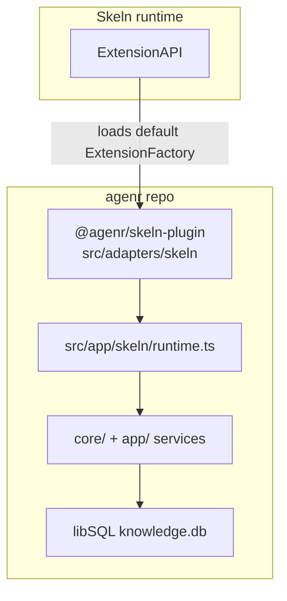

# Skeln Plugin

`src/adapters/skeln/` is agenr's Skeln integration.
The publishable package lives in `packages/skeln-plugin` and ships as `@agenr/skeln-plugin`.
The Skeln extension id is `agenr`, so runtime identity and config keys stay stable across installs.

This document describes the current codebase, not an aspirational design.

## What the plugin does today

The Skeln plugin is a translator around agenr's existing core and app workflows. It currently does all of the following:

- registers eight agent tools: `agenr_store`, `agenr_recall`, `agenr_fetch`, `agenr_update`, `agenr_work`, `get_goal`, `create_goal`, and `update_goal`
- injects session-start durable-memory context on the first turn of each Skeln session
- injects conservative before-turn recall on later turns when confidence warrants it
- injects transient `<agenr_work_context>` working memory via non-persistent `transientMessages` when `features.workingMemory` is enabled
- appends static memory doctrine to the Skeln system prompt on the first turn (and on later turns when recall injects)
- resolves embeddings and optional claim extraction from agenr config credentials, not Skeln host auth
- on `session_shutdown` with reason `quit`, captures a synchronous transcript snapshot, runs bounded shutdown episode capture when enabled, then closes the shared agenr database handle; the lifecycle handler awaits that chain unless Skeln registers `deferWork`, in which case the host keeps the process alive until both finish

The adapter is intentionally not a second memory brain. Durable memory, recall ranking, claim-key lifecycle, session-start selection, and before-turn selection still live in agenr core and app layers.

## Relationship to the OpenClaw plugin

The Skeln integration is deliberately scoped down from [`docs/OPENCLAW-PLUGIN.md`](./OPENCLAW-PLUGIN.md).

Current Skeln omissions:

- no `agenr_retire` or `agenr_trace`
- no predecessor continuity summaries
- no background predecessor episode ingest
- no OpenClaw transcript parsing or episode writer
- no mid-session `[MEMORY CHECK]` store nudges
- no OpenClaw memory-runtime bridge or debug JSONL sink

Shared behavior:

- the same libSQL knowledge database and agenr config resolution rules
- the same unified recall, store pipeline, and claim-key update semantics
- the same host-neutral session-start and before-turn app services
- shared tool schemas, parsers, and runners in `src/adapters/shared/memory-tools.ts`
- shared injection formatting in `src/adapters/shared/injection/`

## Two-layer packaging



Today the agenr repo owns both the memory engine and the default Skeln extension entrypoint.

A future thin operator-facing extension in the skeln repo (`@skeln/agenr`) can call `registerAgenrSkelnMemory(skeln, { getHostContext })` to supply richer Skeln-native scope facts such as git root, branch, and project labels. The adapter already exposes that seam; the skeln-repo package is not required for the first deliverable.

## Code map

- `src/adapters/skeln/index.ts` - extension entry, lifecycle hook registration, tool registration, config merge, and shutdown cleanup.
- `src/adapters/skeln/config.ts` - reads and validates the JSON `memoryPolicy` Skeln setting; merges with programmatic registration options.
- `src/adapters/shared/plugin-memory-policy-config.ts` - shared `memoryPolicy` validation used by Skeln and OpenClaw config parsers.
- `packages/skeln-plugin/package.json` and `packages/skeln-plugin/build.mjs` - publishable package metadata, Skeln manifest, and dist copy step.
- `packages/skeln-plugin/src/index.ts` - package re-export of the built adapter entry.
- `src/app/skeln/runtime.ts` - Skeln runtime composition: path resolution, DB open, embeddings, recall, session-start and before-turn deps, agenr-config-based claim extraction, and close lifecycle.
- `src/app/plugin-runtime/` - shared host plugin memory composition reused by OpenClaw and Skeln.
- `src/adapters/skeln/runtime.ts` - thin re-export of the app-owned runtime composition function.
- `src/adapters/skeln/types.ts` - `SkelnHostContext`, registration options, and resolved session scope types.
- `src/adapters/skeln/session/scope.ts` - session-key derivation, host-context merge, and scope conversion.
- `src/adapters/skeln/session/state.ts` - per-session scope tracker used across lifecycle hooks.
- `src/adapters/skeln/tools/` - one file per Skeln tool plus shared param parsing and result shaping.
- `src/adapters/shared/memory-tools.ts` - shared tool schemas, parsers, and runners for store, recall, and update.
- `src/adapters/shared/memory-tool-format.ts` - shared log formatters and sanitizers.
- `src/adapters/skeln/hooks/before-agent-start.ts` - session-start and before-turn injection orchestration.
- `src/adapters/skeln/hooks/message-text.ts` - prompt and branch text extraction for before-turn queries.
- `src/adapters/skeln/format/prompt-section.ts` - static system-prompt doctrine for the core Skeln memory tools.
- `src/adapters/shared/injection/session-start-format.ts` and `src/adapters/shared/injection/before-turn-format.ts` - shared injection text rendering.
- `src/app/plugin-runtime/session-tracking.ts` - in-process session-start dedup shared by host plugins.

## Packaging and identity

Install the plugin package, not the main CLI package:

```bash
pnpm link --global ./packages/skeln-plugin
skeln extension add @agenr/skeln-plugin
```

The runtime extension id is `agenr`, so Skeln config uses:

- `extensions.settings.agenr.*`
- `extensions.paths` or `skeln extension add` for local installs

For local development across the agenr and skeln repos, keep a sibling `skeln` checkout at `../skeln` relative to the agenr repo root so workspace file links resolve, then build and link `@agenr/skeln-plugin` from this checkout.

Build steps:

```bash
pnpm build
node packages/skeln-plugin/build.mjs
```

The Skeln package bundles the compiled adapter entry plus shared `dist/chunk-*.js` files. `skeln`, `@earendil-works/pi-agent-core`, `@earendil-works/pi-ai`, and `typebox` remain external and are resolved by Skeln at load time.

## Manifest and config

The Skeln manifest in `packages/skeln-plugin/package.json` declares extension id `agenr` and these settings:

- `dbPath` - optional DB path override
- `configPath` - optional agenr config path override
- `project` - optional project label for recall and store scope
- `wip` - optional boolean override for automatic working-context injection
- `memoryPolicy` - optional JSON string with the same nested shape as the OpenClaw agenr plugin `memoryPolicy` block

Skeln extension settings are flat `boolean | string` values, so nested `memoryPolicy` is stored as JSON text rather than a nested object.

Example Skeln config fragment after `skeln extension add @agenr/skeln-plugin`:

```json
{
  "extensions": {
    "settings": {
      "agenr": {
        "memoryPolicy": "{\"sessionStart\":{\"enabled\":false,\"coreMemory\":false,\"relevantDurableMemory\":false},\"beforeTurn\":{\"enabled\":false,\"procedureSuggestion\":false},\"workingContext\":{\"enabled\":true}}"
      }
    }
  }
}
```

Optional overrides such as `dbPath` and `configPath` use the same `extensions.settings.agenr.*` namespace:

```json
{
  "extensions": {
    "settings": {
      "agenr": {
        "dbPath": "/home/me/.agenr/knowledge.db",
        "configPath": "/home/me/.agenr/config.json",
        "memoryPolicy": "{\"beforeTurn\":{\"enabled\":true,\"procedureSuggestion\":false},\"sessionStart\":{\"relevantDurableMemory\":true}}"
      }
    }
  }
}
```

Supported `memoryPolicy` keys match the shared plugin contract:

- `memoryPolicy.sessionStart.enabled` - optional toggle for all session-start memory injection; defaults to true
- `memoryPolicy.sessionStart.coreMemory` - optional toggle for always-on core memory injection at session start; defaults to true
- `memoryPolicy.sessionStart.relevantDurableMemory` - optional toggle for artifact-grounded relevant durable memory during session-start injection
- `memoryPolicy.beforeTurn.enabled` - optional toggle for the proactive before-turn patch path
- `memoryPolicy.beforeTurn.procedureSuggestion` - optional toggle for the before-turn procedure section
- `memoryPolicy.beforeTurn.maxDurableEntries` - optional normal durable-item cap for before-turn recall
- `memoryPolicy.beforeTurn.recallThreshold` - optional durable-recall score floor for before-turn recall
- `memoryPolicy.beforeTurn.highConfidenceRecallThreshold` - optional score floor required before before-turn recall can expand beyond the normal durable-item cap
- `memoryPolicy.beforeTurn.procedureThreshold` - optional score floor for proactive procedure suggestion
- `memoryPolicy.workingContext.enabled` - optional toggle for automatic transient `<agenr_work_context>` injection; defaults to true when `features.workingMemory` is enabled
- `memoryPolicy.slotPolicies.attributeHeads` - optional attribute-head overrides for read-time claim-slot policy classes

Unknown keys inside the parsed JSON object are rejected.

Invalid `memoryPolicy` JSON logs a startup warning and is ignored; other settings still apply.

Programmatic overrides passed to `registerAgenrSkelnMemory({ memoryPolicy })` merge on top of Skeln settings, with registration options winning at each nested level.

Path resolution follows the shared agenr plugin rules:

1. plugin `configPath`, if set
2. `AGENR_CONFIG_PATH`
3. `config.json` next to an overridden `dbPath`
4. `~/.agenr/config.json`

Then DB resolution is:

1. plugin `dbPath`, if set
2. `AGENR_DB_PATH`
3. `dbPath` from agenr config
4. `~/.agenr/knowledge.db`

## Registration lifecycle

`registerAgenrSkelnMemory()` in `src/adapters/skeln/index.ts` creates one shared process-lifetime services promise plus one session scope tracker and one session-start tracker.

The plugin currently wires:

- the three memory tools
- `session_start`
- `before_agent_start`
- `tool_result`
- `session_shutdown`

Current lifecycle behavior:

- `session_start` resolves session scope, remembers it in the scope tracker, and records first-turn facts in the shared session-start tracker
- `before_agent_start` runs session-start recall on the first turn for a tracked session identity, then before-turn recall on later turns
- `tool_result` maps structured agenr failed tool details (`details.status === "failed"`) to Skeln `{ isError: true }` because Skeln's `AgentToolResult` type does not carry an inline error flag
- `session_shutdown` routes session-memory intake, clears remembered scope for the ending session (before episode scheduling), snapshots transcript target facts synchronously, then dispatches optional bounded shutdown episode capture from that snapshot
- non-`quit` shutdown reasons start episode capture in the background without closing the shared database handle; this is best-effort and may not finish if the host exits or reloads quickly
- `quit` shutdown without `deferWork` awaits episode capture (when enabled) and `services.close()` in the lifecycle handler; when Skeln supplies `deferWork`, the same chain runs under host deferral so stale extension context is never read after shutdown

The default package export is a Skeln `ExtensionFactory` that calls `registerAgenrSkelnMemory(skeln)` with manifest-backed settings only.

Hosts that need richer scope can import `registerAgenrSkelnMemory` directly and pass `getHostContext(context)` to merge git root, branch, project, or a custom session key over adapter-derived defaults.

## Shared runtime services

`createAgenrSkelnServices()` in `src/app/skeln/runtime.ts` builds the shared services used by tools and injection hooks.

Current composition includes:

- the libSQL database adapter
- the app-layer session-start dependency bundle
- the app-layer before-turn dependency bundle
- an embedding client when embedding config is valid
- an always-throwing embedding port when embeddings are unavailable
- the recall adapter used by unified recall
- optional claim extraction resolved from agenr config credentials via `createClaimExtractionFromAgenrConfig`
- read-time slot-policy overrides from `memoryPolicy.slotPolicies`

Important current behavior:

- embedding availability is resolved from agenr config without a startup network probe
- `agenr_recall` stays available even when embeddings are unavailable and can degrade entry recall into lexical-only mode
- session-start core-memory injection does not need embeddings
- before-turn procedure suggestion degrades to lexical-only ranking when query embeddings are unavailable
- claim extraction is only wired when agenr claim-extraction config is enabled and credentials resolve

Unlike OpenClaw, Skeln does not use host-authenticated LLM clients for claim extraction or continuity generation.

## Session scope and identity

Skeln uses two session key shapes on purpose:

- `resolveSkelnSessionKey()` in `src/adapters/skeln/session/scope.ts` builds `skeln:session:…` recall and store routing keys scoped to one Skeln session lifetime and cwd
- `createSessionStartTracker()` in `src/app/plugin-runtime/session-tracking.ts` builds `session:…` / `key:…` keys for in-process first-turn tracking

Do not collapse these helpers without revisiting recall provenance.

Default scope resolution:

1. read the active Skeln session id and cwd from `ExtensionContext`
2. reuse remembered scope from `session_start` when available
3. merge optional `getHostContext()` output from the host extension
4. derive `sessionKey` as `skeln:session:<sessionId>:cwd:<cwd>` when cwd is present, otherwise `skeln:session:<sessionId>`

Store provenance uses source prefix `skeln-session:<sessionKey>`.

## Static prompt guidance

`buildAgenrSkelnMemoryPromptSection()` appends static guidance to the Skeln system prompt on every injected turn.

Current guidance covers:

- call `agenr_recall` before answering questions about prior work, decisions, preferences, dates, unfinished work, or past sessions
- session-start and before-turn injection are background context, not user text
- `mode=entries` for exact durable facts and decisions
- `mode=auto` for normal recall and historical-state questions
- `mode=episodes` for explicit session-narrative recall
- storage doctrine for `agenr_store`
- use `agenr_update` for metadata corrections and `agenr_store` with `supersedes` for substantive replacement

This section is static doctrine only. It does not itself recall memory or inject session-start results.

## Context injection

Skeln injects memory through the `before_agent_start` hook rather than a separate prompt-build hook.

### Session-start recall

On the first tracked turn for a session identity, the handler:

1. appends memory doctrine to `systemPrompt` when it is not already present
2. calls `runSessionStart({ sessionKey, policy }, services.sessionStart)`
3. renders the patch with `formatAgenrSessionStartRecall()`
4. returns a hidden user `AgentMessage` when the rendered block is non-empty

Current session-start policy defaults:

- `maxCoreEntries = 4`
- `maxArtifactRecallEntries = 3`
- `maxDurableEntries = 5`
- `maxArtifactChars = 1200`
- session-start memory injection enabled unless `memoryPolicy.sessionStart.enabled === false`
- always-on core memory enabled unless `memoryPolicy.sessionStart.coreMemory === false`
- artifact-grounded relevant durable memory enabled unless `memoryPolicy.sessionStart.relevantDurableMemory === false`

Failures log a warning and still return the doctrine-augmented system prompt.

### Before-turn recall

On later turns, the handler:

1. skips injection when `memoryPolicy.beforeTurn.enabled === false`
2. normalizes the current prompt text; blank prompts skip injection
3. reads recent branch messages from `context.sessionManager.getBranch()`
4. calls `runBeforeTurn(...)` with the current turn text and recent turns
5. renders the patch with `formatAgenrBeforeTurnRecall()`
6. returns a hidden user `AgentMessage` when the rendered block is non-empty

Current before-turn policy defaults:

- `maxDurableEntries = 1`
- `maxHighConfidenceDurableEntries = 2`
- `maxRecentTurns = 2`
- `maxQueryChars = 450`
- `maxProcedureCandidates = 3`
- `recallThreshold = 0.6`
- `highConfidenceRecallThreshold = 0.85`
- `procedureThreshold = 0.72`
- procedure suggestion enabled unless `memoryPolicy.beforeTurn.procedureSuggestion === false`

Configured thresholds and caps from `memoryPolicy.beforeTurn` override the defaults above.

Injection messages are real `@earendil-works/pi-agent-core` `AgentMessage` objects. Skeln persists them and adds them to model context as non-user background text.

### Phase 0 working-context contract

Working memory uses a separate transient context contract from the durable session-start and before-turn recall path above.

Phase 0 chooses Skeln's non-persistent `context` provider path for future `<agenr_work_context>` delivery. Skeln may expose this as a `context` lifecycle event or provider-context transform. If Skeln later offers equivalent `before_agent_start` context fields, they must be explicitly non-persistent, such as `transientMessages` or `contextMessages` with `persist: false`.

Agenr will return this projection shape:

```ts
interface WorkingContextProjection {
  kind: "working_set";
  renderMode: "stub" | "full";
  content: string;
  workingSetId?: string;
  revision?: number;
  sourceRef: string;
  byteLength: number;
}
```

Skeln must not append the rendered projection to persisted session messages. If Skeln persists an audit record, it should persist only a compact pointer:

```ts
interface WorkingContextAuditPointer {
  source: "agenr_work";
  workingSetId: string;
  revision: number;
  sourceRef: string;
  bytes: number;
  summary?: string;
}
```

That audit pointer is not live replay text. Compaction, branch summarization, and episode mining must exclude rendered `<agenr_work_context>` by default. The current hidden-message durable recall path may stay as-is until it is intentionally redesigned, but volatile working context may not use that persisted path.

The working-memory scope contract uses host-neutral `conversationKey` or `runtimeThreadKey` when the host has a cross-session conversation identity. Skeln is not required to supply `threadId`; `hostThreadId` is compatibility-only when a host actually names that field.

Phase 0 defines four agenr config feature flags, all defaulting to false:

- `features.workingMemory`
- `features.sessionTreeLineage`
- `features.sessionTreeCompaction`
- `features.goalContinuation`

`features.workingMemory` enables the v11 ledger, `agenr_work`, trusted Skeln work commands, and `/goal` aliases. `features.sessionTreeLineage` enables v12 lineage intake for lifecycle events such as resume, fork, clone, and subagent spawn. `features.sessionTreeCompaction` enables v12 checkpoint artifact intake. Automatic per-turn working-context injection is controlled separately through `memoryPolicy.workingContext.enabled` and defaults to on when working memory is enabled.

## Tool behavior

The plugin registers memory and goal tools from `src/adapters/skeln/tools/`.

Tool cores live in `src/adapters/shared/memory-tools.ts`. Skeln adapters only wire schemas, scope resolution, logging, and result formatting.

### `agenr_store`

`agenr_store` is a thin wrapper over `storeEntriesDetailed(...)`.

Current behavior:

- stores exactly one entry per call
- sets `source_file` to `skeln-session:<sessionKey>`
- defaults `source_context` to `Stored via agenr_store from Skeln.`
- can attach manual claim-support metadata when `claimKey` is supplied
- can use optional claim extraction when enabled in agenr config
- returns structured `details` including `sessionKey`
- unexpected failures return `details.status = "failed"` and are promoted to Skeln tool errors through the `tool_result` hook

### `agenr_recall`

`agenr_recall` calls `runUnifiedRecall()`.

Current behavior:

- attaches `sessionKey` for recall telemetry
- degrades entry recall into lexical-only mode when query embeddings or vector search fail
- supports unified routing across exact entry recall, historical-state recall, procedural recall, and episodic recall
- returns routing metadata, rendered text, structured entry previews (not full bodies), episode results, and notices
- entry previews are truncated in both text and structured details; use `agenr_fetch` for the full stored body
- appends a `Fetch Guidance` section in tool text when any entry preview was truncated

See [`docs/RECALL.md`](./RECALL.md) for the full recall contract.

### `agenr_fetch`

`agenr_fetch` returns the full body and metadata for one durable entry.

Current target selectors:

- exactly one of `id` or `subject`

Current behavior:

- reuses the same id/subject resolution rules as `agenr_update`
- returns full `content` in both tool text and structured details up to 32,768 trimmed characters
- rejects larger bodies with an actionable error; use the CLI for oversized entries
- intended after `agenr_recall` when `preview_truncated=true` or exact stored wording is required

### `agenr_update`

`agenr_update` mutates an existing entry in place through the shared update runner.

Current behavior:

- accepts exactly one target selector: `id` or `subject`
- supports metadata updates including `importance`, `expiry`, `claimKey`, `validFrom`, and `validTo`
- writes normalized claim-key lifecycle metadata when `claimKey` is updated

There is no Skeln `agenr_retire` tool in the first deliverable. Retire flows must go through the OpenClaw plugin, surgeon maintenance, or another host surface.

### `agenr_work` and Goal Aliases

`agenr_work` is the model-facing working-memory tool. It exposes typed WIP operations such as `merge_checkpoint`, file notes, command notes, decisions, assumptions, next actions, and candidate memories. Host-only operations are intentionally not in the model schema.

The plugin also registers Codex-compatible `get_goal`, `create_goal`, and `update_goal` aliases:

- `get_goal` returns structured goal JSON with status, revision, checkpoint, continuation policy, budget counters, and remaining token budget.
- `create_goal` creates one active working set for the resolved scope and may initialize a token budget when the model was explicitly instructed to do so.
- `update_goal` only allows `complete` or `blocked`; pause, resume, budget, usage, and close state remain trusted host controls.

Trusted Skeln UI and lifecycle code can call `executeWorkCommand(...)` on the controller returned by `registerAgenrSkelnMemory(...)`. That path can set `continuationPolicy: "on_idle"`, configure budgets, account token/time/turn usage, record heartbeat, lease, resume, and stale metadata, and call `prepare_external_goal_mutation` before external `/goal` mutations. These trusted operations update Agenr state but do not schedule continuation turns; Skeln owns the runtime loop.

## Tool failure signaling

Skeln's `AgentToolResult` type does not accept an inline `isError` flag on the result object.

Agenr tools therefore encode logical failures in structured details:

```json
{ "status": "failed" }
```

The `tool_result` hook in `src/adapters/skeln/index.ts` watches agenr tool names and promotes those structured failures to `{ isError: true }` for Skeln's host boundary.

## Boundaries and guardrails

Follow the repo guardrails in [`AGENTS.md`](../AGENTS.md):

- `src/adapters/skeln/` is a translator, not a second memory brain
- shared durable-memory, recall, and claim-key logic belongs in `core/` or `app/`
- Skeln hook wiring, tool schemas, session scope helpers, continuity-free injection, and result formatting belong in `src/adapters/skeln/`
- the adapter must not call `process.exit()`
- env flags must use explicit string comparisons such as `"true"` or `"1"`

If this document and the code disagree, the code wins.

## Forward compatibility

The Skeln integration is the front edge of the Working Memory PRD seam:

- `getHostContext()` and `SkelnHostContext` are the extension point for richer scope fields
- `src/app/skeln/runtime.ts` composes working-set repositories, `agenr_work`, and goal aliases
- `before_agent_start` is the hook used for transient working-context injection

Autonomous idle continuation is still host-owned future work. Agenr persists the goal state, budgets, and runtime metadata that Skeln's loop will consume.

## Current test coverage

The current adapter and app tests cover:

- Skeln config parsing and `memoryPolicy` merge behavior
- session-key derivation and host-context merge
- session scope tracker behavior
- before-agent-start session-start and before-turn injection behavior
- working-memory goal aliases and trusted Skeln work commands
- Skeln runtime claim-extraction wiring from agenr config

See:

- `tests/adapters/skeln/`
- `tests/app/skeln/runtime.test.ts`
